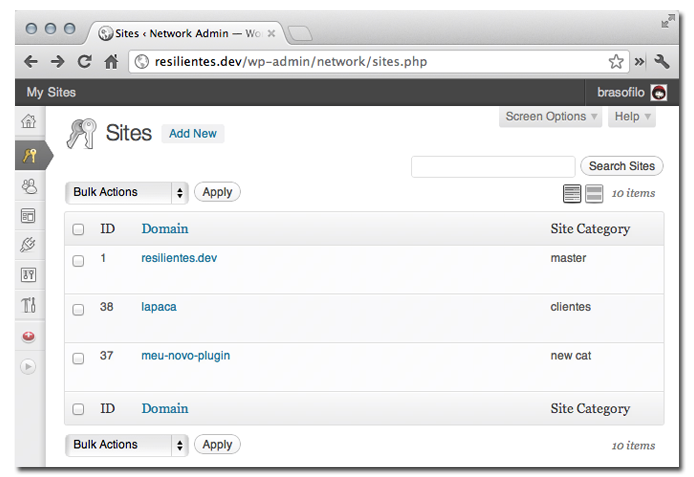
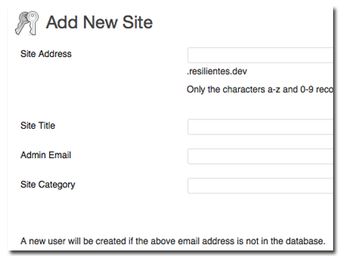
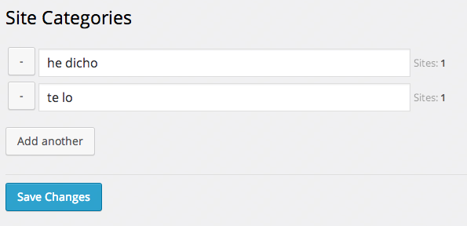

# Multisite Site Category 


WordPress plugin for managing sites categories.

## Description
The plugin adds a new field "category" to the Site Info screen. 
A sortable column is also added in the Sites list screen.
A Categories submenu is created under Sites, add or remove categories there.

The column `mature` in the table `wp_blogs` is being used as index to the categories.  
This is a workaround to allow sorting the sites based on categories.  
There's a filter being applied (except in the sites screen) that tells WordPress that the site is **not mature**:
```
if( 'sites.php' != $pagenow )
    add_filter( 'blog_details', array( $this, 'hack_mature_queries' ) );	
public function hack_mature_queries( $details )
{
    $details->mature = 0;
    return $details;
}
```
Sooo... this workaround assumes the Multisite doesn't contain mature material ;)

Right now, there's no category selection when creating or signing up for new sites.  
The code from the old plugin is [still present](https://github.com/brasofilo/multisite-site-category/blob/master/inc/class-sites-categories-signup.php), but inactive.  
To be able to sort the sites, the logic changed a lot and I haven't revised the new site features.

Available hooks:
```
// Cache time, default 3600 (1hour)
add_filter( 'msc_transient_time', function(){ return 1; } );
// For debugging purposes
add_filter( 'msc_show_mature_column', '__return_true' );
```

Originally based on this [WordPress Question](http://wordpress.stackexchange.com/q/50235/12615).  
[Here's a copy](https://gist.github.com/brasofilo/6715423) of the first version of the plugin.

## Installation

1. Unpack the download-package
1. Upload the file to the `/wp-content/plugins/` directory
1. Activate the plugin through the 'Network Plugins' menu in WordPress

## Screenshots

**Sites Manager showing the debug column *mature*.**



**Site info**



**Manage categories**




## Other Notes
### Licence
Released under GPL, you can use it free of charge on your personal or commercial blog.